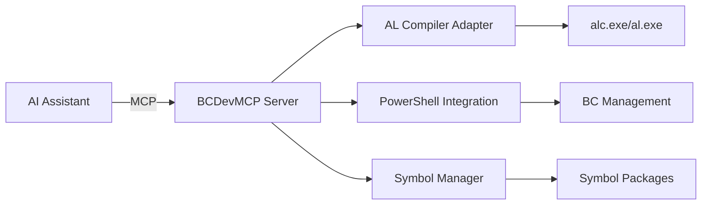

# Business Central Development MCP Server

<div align="center">

[](https://github.com/SShadowS/BCDevMCP)
[](https://modelcontextprotocol.io)
[](https://www.typescriptlang.org/)
[](LICENSE)

**Streamline your Business Central development with AI-powered tools**

[Features](#features) • [Quick Start](#quick-start) • [Tools](#tools) • [Documentation](#documentation)

</div>

## Overview

BCDevMCP is a Model Context Protocol (MCP) server that bridges AI assistants with Business Central development tools. It provides seamless integration with the AL compiler, PowerShell cmdlets, and Business Central environments to accelerate your development workflow.

## Features

✨ **AI-Powered Development** - Integrate with Claude, GitHub Copilot, and other MCP-compatible AI assistants  
🔧 **Complete AL Toolchain** - Compile, publish, and manage Business Central extensions  
📦 **Symbol Management** - Download and manage AL symbols from multiple sources  
🚀 **Code Generation** - Generate AL objects from templates with best practices  
🔄 **Multi-Environment Support** - Work with on-premises, Docker, and cloud deployments  

## Quick Start

### Prerequisites

- **Node.js** 18.0 or later
- **.NET SDK** 9.0 or later
- **Business Central Development Tools**

### Installation

1. **Clone the repository**
   ```bash
   git clone https://github.com/SShadowS/BCDevMCP.git
   cd BCDevMCP
   ```

2. **Install dependencies**
   ```bash
   npm install
   ```

3. **Install Business Central tools**
   ```bash
   # Install .NET SDK
   winget install Microsoft.DotNet.SDK.9

   # Install BC Development Tools
   dotnet tool install Microsoft.Dynamics.BusinessCentral.Development.Tools \
     --interactive --prerelease --global
   ```

4. **Configure your AI assistant**
   
   Add to your MCP settings (e.g., Claude Desktop):
   ```json
   {
     "mcpServers": {
       "bc-dev": {
         "command": "node",
         "args": ["U:\\Git\\BCDevMCP\\dist\\index.js"]
       }
     }
   }
   ```

## Tools

### 🔨 compile-app
Compile Business Central AL projects with full dependency resolution.

```typescript
// Example usage
{
  "projectPath": "C:/MyBCApp",
  "outputPath": "C:/MyBCApp/.alpackages",
  "packageCachePath": "C:/MyBCApp/.alpackages"
}
```

### 📤 publish-app
Deploy compiled apps to Business Central environments.

```typescript
// Example usage
{
  "appPath": "C:/MyBCApp/MyApp.app",
  "serverInstance": "BC240",
  "publishMethod": "powershell"
}
```

### 📥 download-symbols
Download symbol packages from Business Central servers.

```typescript
// Example usage
{
  "serverUrl": "http://localhost:7049/BC240",
  "outputPath": "C:/MyBCApp/.alpackages",
  "publisher": "Microsoft"
}
```

### 🎯 generate-al
Generate AL code from templates for tables, pages, codeunits, and more.

```typescript
// Example usage
{
  "objectType": "table",
  "id": 50100,
  "name": "MyCustomTable",
  "outputPath": "C:/MyBCApp/src"
}
```

## Architecture



## Development

### Building from source
```bash
npm run build
```

### Running tests
```bash
npm test
```

### Project Structure
```
BCDevMCP/
├── src/
│   ├── index.ts           # MCP server entry point
│   ├── adapters/          # External tool adapters
│   └── tools/             # MCP tool implementations
├── test/                  # Test suites
└── dist/                  # Compiled output
```

## Contributing

We welcome contributions! Please see our [Contributing Guide](CONTRIBUTING.md) for details.

## Roadmap

- [ ] AL Test Runner integration
- [ ] Project scaffolding templates
- [ ] Enhanced Docker support
- [ ] Translation management (XLIFF)
- [ ] Workspace analysis tools

## Support

- 📚 [Documentation](docs/)
- 💬 [Discussions](https://github.com/SShadowS/BCDevMCP/discussions)
- 🐛 [Issue Tracker](https://github.com/SShadowS/BCDevMCP/issues)

## License

This project is licensed under the MIT License - see the [LICENSE](LICENSE) file for details.

---

<div align="center">
Built with ❤️ for the Business Central community
</div>
